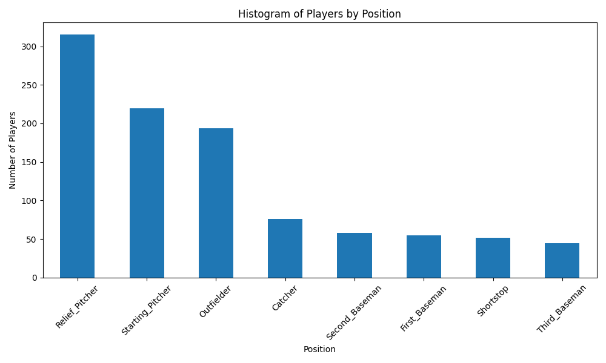

# Pandas Description - IDS Week 2
Simple script loading and describing a baseball dataset. Built off the python-template week 1 miniproject and uses Github Actions to auto build, lint, and test the project. Fulfills Noah Gift's IDS 706 Mini project 2.

Updated to visualize the data set by grouping each player by position listed and comparing how many players play each position. 

